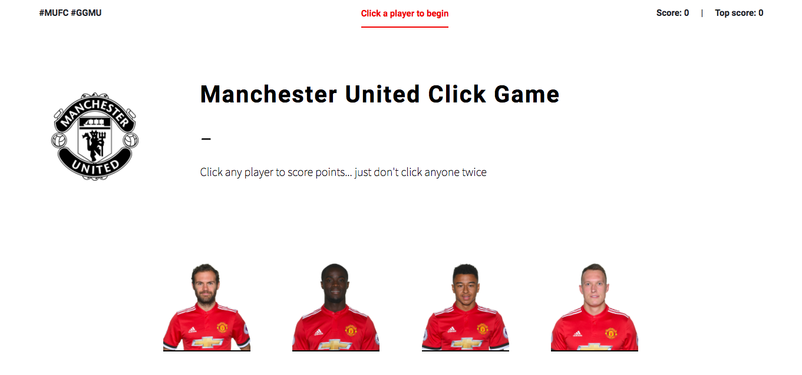
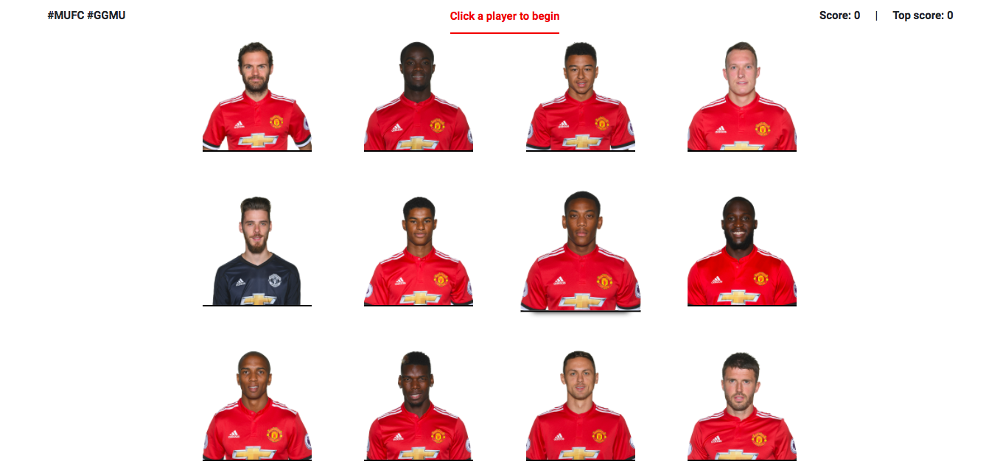

# Manchester United Memory Game
.\
.
### Idea

A simple memory game. Just remember which players you've clicked and which you haven't... entertainingly harder than it looks. Infinitely more so if you don't know the players names!\
.\
.
### Using the app

From home view:\
.\
.
\
.\
.\
Scroll down to get all 12 players in view:\
.\
.
\
.\
.\
Then simply click the players you haven't clicked yet. The score is calculated in the top right, with the high score being logged and updated when beaten.\
.\
.
### Technologies and Code

The game was built in React, using the recommended React generation NPM/Yarn tool create-react-app. As this is a relatively simple web app, no back end technologies are needed - hence its deployment on Github pages.\
.\
.
### UI / UX

Black and white are two of the colors of Manchester United, so they made for a good choice for the color scheme. And this simplicity makes the heroes of Man United the focal point in their red.

The size of the players was limited by the functional need to show all of them (plus the navbar) within 100vh. A 3 x 4 grid fit this need well. CSS animations enlarge the players when hovered over.

The navbar contains the score so it's best if it's always visible. Fixing it to the top of the viewport achieves this. The changing message in the middle of the navbar is red in order to attract attention to its continuously responding message.

This web app isn't mobile responsive as it's designed to be a desktop game. It would have to be entirely rethought to be possible to achieve a similar result on mobile.\
.\
.
